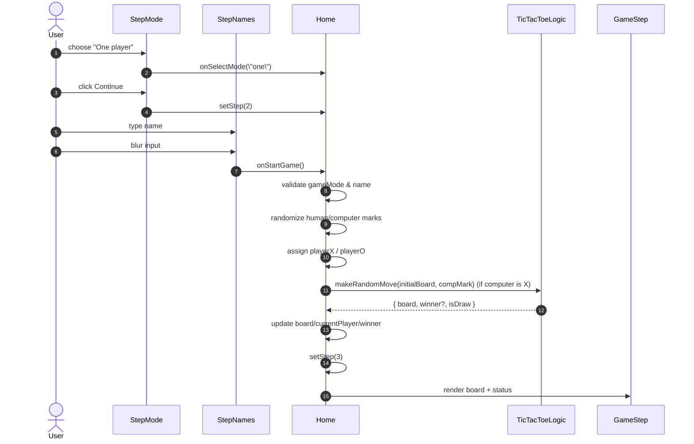
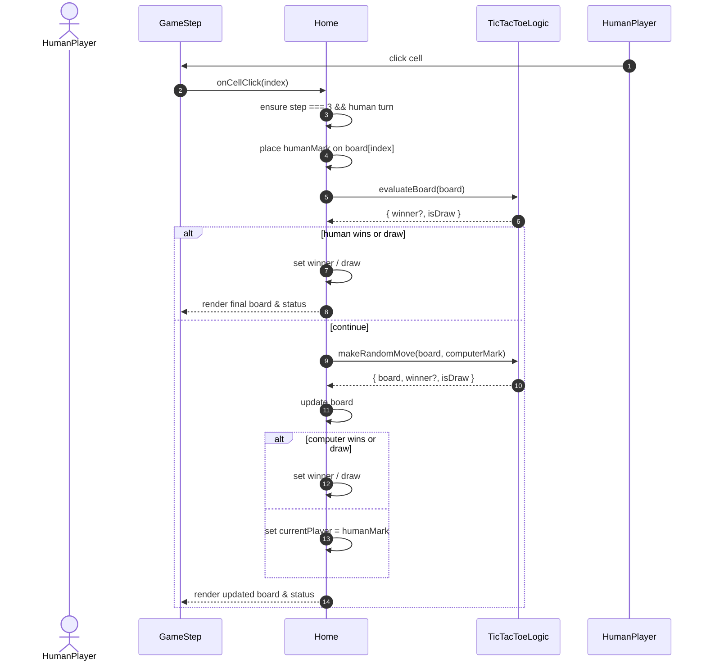

## Tic Tac Toe App – UML Overview

This document describes the main structure and flows of the tic-tac-toe application using UML-style diagrams (Mermaid).

### Component & Logic Structure (Class Diagram)

```mermaid
classDiagram
direction LR

class Home {
  - step : Step
  - gameMode : GameMode
  - playerX : string
  - playerO : string
  - singlePlayerName : string
  - board : CellValue[9]
  - currentPlayer : PlayerMark
  - winner : PlayerMark | "Draw" | null
  - humanMark : PlayerMark | null
  - computerMark : PlayerMark | null
  + startGameFromSetup()
  + handleCellClick(index)
  + handleBackToMode()
  + handleBackToNames()
}

class StepIndicator {
  + step : Step
}

class StepMode {
  + gameMode : GameMode
  + onSelectMode(mode)
  + onContinue()
}

class StepNames {
  + gameMode : GameMode
  + playerX : string
  + playerO : string
  + singlePlayerName : string
  + onChangePlayerX(value)
  + onChangePlayerO(value)
  + onChangeSinglePlayerName(value)
  + onBackToMode()
  + onStartGame()
}

class GameStep {
  + gameMode : GameMode
  + board : CellValue[9]
  + currentPlayer : PlayerMark
  + winner : PlayerMark | "Draw" | null
  + onCellClick(index)
  + onPlayAgain()
  + onChangeSetup()
}

class TicTacToeLogic {
  + calculateWinner(cells) : PlayerMark?
  + evaluateBoard(cells) : { winner, isDraw }
  + makeRandomMove(cells, mark) : { board, winner, isDraw }
}

Home --> StepIndicator : renders
Home --> StepMode : renders (step 1)
Home --> StepNames : renders (step 2)
Home --> GameStep : renders (step 3)
Home ..> TicTacToeLogic : uses
```

### One-Player Game Start (Sequence Diagram)



### Player Move vs Computer (Sequence Diagram)



You can view these diagrams directly in tools that support Mermaid (such as GitHub, many markdown preview plugins, or online Mermaid editors).

